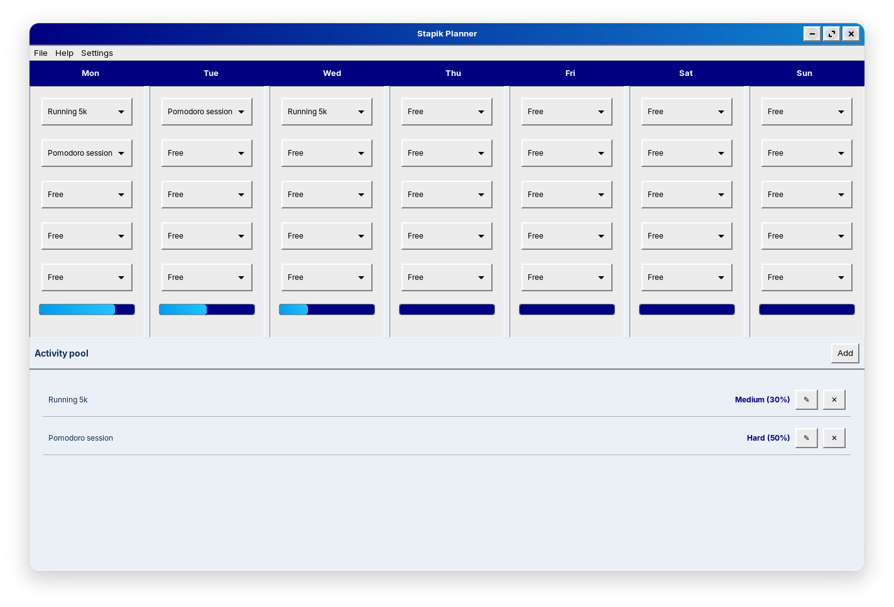
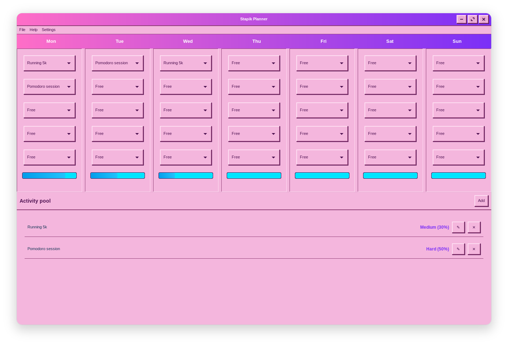
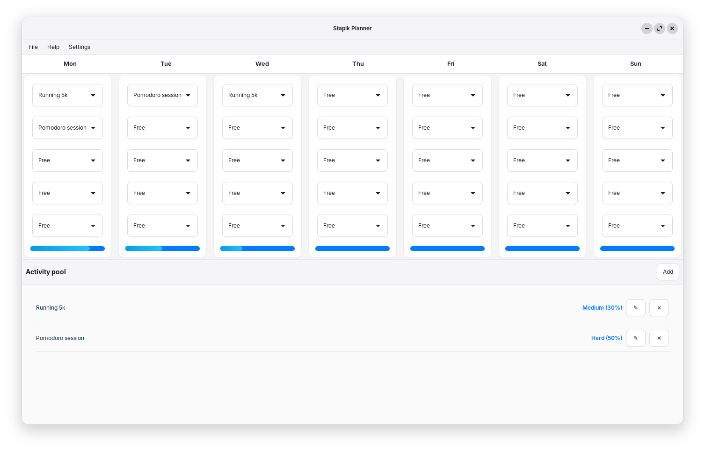

# Stapik Planner

A desktop weekly activity planner for Linux, written in C++20 using GTK4/gtkmm. Styled after the retro old-school aesthetic, matching [Stapik Calendar](https://github.com/Stapik-Group/stapik-calendar).



## Features

- **Weekly schedule grid** - seven day columns (Monday–Sunday), each with a configurable number of activity slots
- **Activity catalog** - add, edit and delete reusable activities, each with a name and a difficulty level (Light 10%, Normal 20%, Medium 30%, Hard 50%)
- **Daily load tracking** - a load bar per day shows total workload as a percentage; once a day reaches 100%, its remaining empty slots are locked to prevent overloading
- **Cloud sync** - save and load data via [Stapik Cloud](https://github.com/Stapik-Group/stapik-cloud), with optimistic-concurrency conflict resolution and full version history
- **Multilingual UI** - Polish, English and German interface with instant switching
- **Three themes** - Classic, Modern and Classic Pink, switchable live from the menu, matching Stapik Calendar
- **Auto-save** - schedule and catalog data saved locally after every change
- **Retro aesthetic** — classic look with raised buttons, blue header bar and grey cells by default, consistent with Stapik Calendar

## Dependencies

- `gtkmm-4.0`
- `libcurl`
- [`stapik-common`](https://github.com/Stapik-Group/stapik-common) v1.1.6+ (fetched automatically via CMake FetchContent)
- `nlohmann/json` (fetched automatically via CMake FetchContent, transitively provided by `stapik-common`)

On Ubuntu/Debian:
```bash
sudo apt install libgtkmm-4.0-dev libcurl4-openssl-dev
```

Building a `.deb` package additionally requires `dpkg-dev` (used to auto-detect runtime dependencies):
```bash
sudo apt install dpkg-dev
```

## Building

```bash
git clone https://github.com/Stapik-Group/stapik-planner
cd stapik-planner
cmake -B cmake-build-release -DCMAKE_BUILD_TYPE=Release
cmake --build cmake-build-release
```

## Installation

### Option 1 — Download prebuilt `.deb` (recommended)

Download the latest `.deb` package from the [Releases page](https://github.com/Stapik-Group/stapik-planner/releases), then install it:

```bash
sudo dpkg -i stapikplanner_*.deb
sudo apt install -f   # resolves any missing runtime dependencies
```

### Option 2 — build `.deb` from source

```bash
cd cmake-build-release
cpack -G DEB
sudo dpkg -i stapikplanner_*.deb
sudo apt install -f
```

Either option installs the app to `/usr/lib/stapikplanner/`, with a launcher at `/usr/bin/stapikplanner`, and it appears in the desktop environment's application menu.

### Option 3 — per-user install (no sudo required)

```bash
cmake --install cmake-build-release --prefix "$HOME/.local"
```

Installs to `~/.local/lib/stapikplanner/`, with a launcher at `~/.local/bin/stapikplanner`. Make sure `~/.local/bin` is in your `PATH`.

## Uninstalling

### If installed via `.deb`

```bash
sudo dpkg -r stapikplanner
```

### If installed per-user

```bash
rm -rf ~/.local/lib/stapikplanner
rm ~/.local/bin/stapikplanner
rm ~/.local/share/applications/stapikplanner.desktop
rm ~/.local/share/icons/hicolor/256x256/apps/stapikplanner.png
```

Either way, your schedule data, cloud config and language preference remain at `~/.local/share/stapikplanner/` — see [Data Storage](#data-storage) below if you want to remove those too.

## Cloud Sync

The app supports synchronization via [Stapik Cloud](https://github.com/Stapik-Group/stapik-cloud) — the same server and protocol used by Stapik Calendar. Go to **File → Connect**, enter the server URL and API key. If a connection is already configured, the app reconnects automatically on startup.

Once connected, the app compares the local file and the cloud copy using a `lastUpdate` timestamp and keeps whichever one is newer, overwriting the other **as a whole document**. There is no field-level or entry-level merging — if both copies changed since the last sync, the older one is fully replaced.

Data is saved locally after every change, and the app also attempts to push it to the cloud right away. Writes are optimistic-concurrency-checked: if another device saved a newer version in the meantime, the write is rejected, the server's copy is fetched, and the app retries once against that copy before falling back to accepting the server's version. If the cloud is unreachable at that moment, the change stays saved locally and the app quietly retries on the next save — no data is lost, but the cloud copy will lag behind until the next successful write. You can also trigger a sync manually from **File → Sync**.

**Caution for multi-device use:** since conflict resolution is whole-document, editing the schedule offline on two different machines before either one reconnects can still cause one set of changes to be discarded. Stapik Cloud keeps a version history of every write, so a discarded document isn't gone permanently, but the app itself doesn't yet expose a way to browse or restore old versions. If you use the app on more than one device, make sure to sync (or at least go online) after each editing session to avoid overwriting your own changes.

The app talks to the Stapik Cloud `/documents/{slotKey}` endpoint (slot key `planner.json`), authenticated via an `x-api-key` header. See the [Stapik Cloud API reference](https://github.com/Stapik-Group/stapik-cloud) for details.

If you're upgrading from an app version that used the older, incompatible cloud protocol, the app detects this automatically on first launch and clears the saved connection — you'll need to reconnect once via **File → Connect**.

## Themes

Switch between three themes from **Settings → Theme**: Classic (the original retro look), Modern (flat, minimal), and Classic Pink. The choice applies instantly and is remembered between launches.

## Slots per Day

The number of activity slots per day (3–6) can be changed from **Settings → Slots**. Increasing it adds empty slots to every day; decreasing it truncates each day's plan to the new limit, discarding any activities scheduled beyond it — the app warns you when this happens.

## Data Storage

Schedule, catalog and settings are stored locally at `~/.local/share/stapikplanner/planner.json`, wrapped with a `lastUpdate` timestamp used for cloud sync. Cloud config at `~/.local/share/stapikplanner/config.json`. Language preference at `~/.local/share/stapikplanner/locale.txt`. Theme preference at `~/.local/share/stapikplanner/theme.txt`.

## Themes




## TODO

- [x] Weekly schedule grid with configurable slots per day
- [x] Activity catalog (add / edit / delete)
- [x] Daily load tracking with 100% cap
- [x] Cloud sync with conflict resolution
- [x] Multilingual UI (PL/EN/DE)
- [x] `.deb` package for easier distribution
- [x] In-app UI for changing the number of slots per day
- [x] Multiple themes (Classic / Modern / Classic Pink)
- [ ] Copy a day's plan to another day
- [ ] Weekly load summary / overview
- [ ] Flatpak package